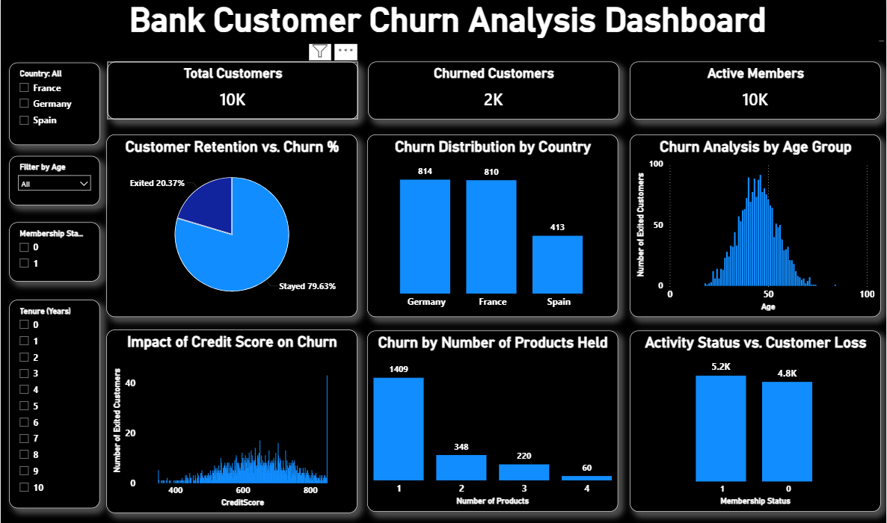

# Bank Customer Churn Intelligence Dashboard (Power BI & Python)

## 📌 Project Overview
Customer attrition (churn) is a critical challenge for banking institutions. This project delivers an end-to-end analytical solution—combining the programmatic power of **Python** for granular data processing with the visual modeling capabilities of **Power BI**. By investigating demographics, credit scores, account behavioral patterns, and product usage across 10,000 customers, this repository uncovers actionable data-driven insights to help improve bank customer retention strategies.

---

## 📊 Dashboard Preview

---

## 🛠️ Tech Stack & Skills Demonstrated
* **Data Processing & EDA (Python):** Processed raw data using **Pandas** and **NumPy** for advanced handling of missing values, pipeline structuring, and statistical computations.
* **Exploratory Visualizations:** Utilized **Matplotlib** and **Seaborn** within a Jupyter Notebook environment to generate initial correlation matrices and statistical insights.
* **Executive-Level BI Dashboard:** Built a premium, dark-mode data model in **Power BI Desktop** using clean layouts, KPI cards, and dynamic slicers for advanced stakeholder reporting.

---

## 🧠 Key Data Insights & Executive Findings
Based on the combined Python programmatic structure and Power BI visual pipeline, several critical churn drivers were identified:

* **Overall Attrition Density:** The global bank portfolio reflects a distinct **20.37% churn rate**, indicating a total of 2,037 customer exits.
* **Age Demographics Risk:** Churn is heavily concentrated in older demographics. Attrition experiences a steep bell-curve spike, peaking aggressively around the **40–50 age bracket**, whereas younger segments show strong retention stability.
* **Product Risk Exposure:** Customers holding exactly **1 product** account for the absolute highest volume of exits (**1,409 churned users**). Conversely, users with **3 or 4 products** exhibit an extremely high *percentage* rate of attrition, signaling potential service dissatisfaction or misaligned cross-selling pipelines.
* **Geographic Variances:** Germany shows severe retention strain, matching France closely in raw exit counts (**814 vs 810 exits**) despite having a significantly smaller baseline customer footprint.
* **Activity Status Impact:** Inactive members churn at a noticeably higher frequency compared to active account holders, proving that low digital engagement is a leading indicator of upcoming account closures.

---

## 📂 Repository Structure
* `Bank Customer Churn Analysis Dashboard.pbix` - Complete interactive Power BI visualization model.
* `Bank_Customer_Churn_Analysis.ipynb` - Structured Jupyter Notebook documenting data cleaning, Exploratory Data Analysis (EDA), and correlation matrices.
* `churn_dashboard_preview.png` - High-resolution interface preview image of the finalized dashboard.
* `Churn_Modelling.csv` - Source bank customer database spreadsheet.

---

## 🔗 Dataset Source
The data used for this project was extracted from Kaggle. You can access the source file here:
* [Kaggle Bank Customers Dataset](https://www.kaggle.com/datasets/shantanudg3/bank-customers)

---

## 🚀 How to Interact with the Project
1. Open and execute the `.ipynb` file to evaluate core programmatic data transformation and initial correlation logic.
2. Download and launch the `.pbix` file using **Power BI Desktop** to utilize interactive slicers (Country, Age, Tenure) to simulate customer loss scenarios dynamically.
